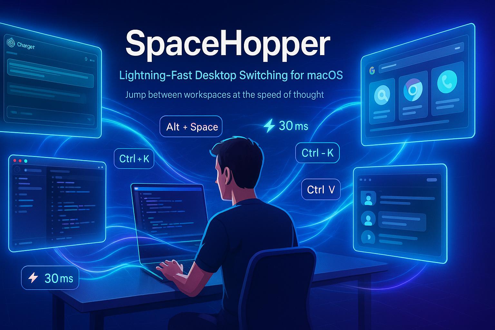

# SpaceHopper



[English](#english) | [中文](#中文)

---

## English

**SpaceHopper** is a comprehensive macOS productivity toolkit for managing virtual desktops and windows across multiple displays. It combines fast desktop switching with intelligent window management, allowing you to create a highly efficient workspace.

### Features

- **Fast Desktop Switching**: Jump between virtual desktops with a single hotkey
- **Application Shortcuts**: One-key shortcuts to specific applications (ChatGPT, VSCode, Chrome, etc.)
- **Multi-Display Support**: Automatic configuration switching based on connected displays
- **Intelligent Window Management**: Automatic window routing to designated spaces

### Project Structure

```
SpaceHopper/
├── bin/                      # Executable scripts
│   ├── space_jump.sh        # Main desktop switcher (Alt+Space)
│   └── app_shortcuts/       # App-specific jump scripts (Ctrl+K, Ctrl+V, etc.)
├── lib/                      # Core libraries
│   ├── core.sh              # Core functions and key mappings
│   └── vscode_tracker.sh    # VSCode position tracking
├── configs/                  # Configuration files
│   ├── yabai/               # Yabai configs for different display setups
│   └── skhd/                # SKHD hotkey configurations
└── docs/                     # Documentation
```

### Prerequisites

- macOS
- [Yabai](https://github.com/koekeishiya/yabai) - Tiling window manager
- [SKHD](https://github.com/koekeishiya/skhd) - Simple hotkey daemon
- `jq` - JSON processor (`brew install jq`)

### Installation

1. **Install dependencies**:
   ```bash
   brew install yabai skhd jq
   brew services start yabai
   brew services start skhd
   ```

2. **Clone the repository**:
   ```bash
   cd ~/Documents/GithubRepo
   git clone <repository-url> SpaceHopper
   cd SpaceHopper
   ```

3. **Configure SKHD**:
   ```bash
   # Backup your existing config
   cp ~/.skhdrc ~/.skhdrc.backup

   # Copy the SpaceHopper config
   cp configs/skhd/skhdrc ~/.skhdrc

   # Restart SKHD
   brew services restart skhd
   ```

4. **Configure Yabai**:
   ```bash
   # Backup existing config
   cp ~/.yabairc ~/.yabairc.backup

   # Choose the appropriate config based on your display count
   # For triple display:
   cp configs/yabai/triple_display.yabairc ~/.yabairc
   # For dual display:
   # cp configs/yabai/dual_display.yabairc ~/.yabairc
   # For single display:
   # cp configs/yabai/single_display.yabairc ~/.yabairc

   # Restart Yabai
   brew services restart yabai
   ```

### Usage

#### Desktop Switching

- **Alt + Space**: Toggle between current desktop and target desktop
  - Single/dual display: Switches to desktop 2
  - Triple display: Switches to desktop 12

#### Application Shortcuts

- **Ctrl + K**: Jump to ChatGPT (desktop 1)
- **Ctrl + V**: Jump to VSCode
- **Ctrl + E**: Jump to Chrome
- **Ctrl + X**: Jump to Music
- **Ctrl + L**: Jump to Log/Chrome
- **Ctrl + O**: Jump to Outlook
- **Ctrl + P**: Jump to PowerPoint
- **Ctrl + T**: Jump to Terminal

#### Window Management

- **Ctrl + Alt + Cmd + R**: Restart Yabai service

#### Productivity Tools

- **F18**: Toggle input method (ABC ⇄ Chinese)

### Customization

#### Modifying Desktop Targets

Edit the display-specific desktop numbers in:
- `bin/space_jump.sh` - Main switcher
- `bin/app_shortcuts/*.sh` - Individual app shortcuts

#### Adding New App Shortcuts

1. Create a new script in `bin/app_shortcuts/`:
   ```bash
   cp bin/app_shortcuts/switch_to_chat.sh bin/app_shortcuts/switch_to_myapp.sh
   ```

2. Edit the target desktop number

3. Add a hotkey binding in `~/.skhdrc`:
   ```
   ctrl - y : zsh /Users/limo/Documents/GithubRepo/SpaceHopper/bin/app_shortcuts/switch_to_myapp.sh
   ```

4. Restart SKHD: `brew services restart skhd`

### Troubleshooting

#### SKHD not responding
```bash
# Check SKHD logs
pkill skhd
skhd &
# Check terminal output for errors
```

#### Yabai windows not routing correctly
```bash
# Restart Yabai
yabai --restart-service

# Or use the hotkey: Ctrl + Alt + Cmd + R
```

#### Desktop switching is slow or fails
- SpaceHopper uses yabai's native commands for instant switching (~30ms)
- For best performance, ensure yabai is running: `brew services start yabai`

### Documentation

- [Desktop Jumper Documentation](docs/README_desktop_jumper.md)
- [Yabai Multi-Display Setup](docs/README_yabai.md)
- [Yabai Configuration Guide](docs/yabairc_config.md)
- [Space Swap Changes](docs/space_swap_changes.md)

---

## 中文

**SpaceHopper** 是一个综合性的 macOS 生产力工具包，用于管理多显示器环境下的虚拟桌面和窗口。它将快速桌面切换与智能窗口管理相结合，让你打造高效的工作空间。

### 功能特性

- **快速桌面切换**: 使用单一快捷键在虚拟桌面间跳转
- **应用快捷键**: 一键跳转到特定应用（ChatGPT、VSCode、Chrome 等）
- **多显示器支持**: 根据连接的显示器自动切换配置
- **智能窗口管理**: 自动将窗口路由到指定的桌面空间

### 项目结构

```
SpaceHopper/
├── bin/                      # 可执行脚本
│   ├── space_jump.sh        # 主桌面切换器 (Alt+Space)
│   └── app_shortcuts/       # 应用专属跳转脚本 (Ctrl+K, Ctrl+V 等)
├── lib/                      # 核心库
│   ├── core.sh              # 核心函数和键码映射
│   └── vscode_tracker.sh    # VSCode 位置追踪
├── configs/                  # 配置文件
│   ├── yabai/               # 不同显示器设置的 Yabai 配置
│   └── skhd/                # SKHD 快捷键配置
└── docs/                     # 文档
```

### 前置要求

- macOS
- [Yabai](https://github.com/koekeishiya/yabai) - 平铺窗口管理器
- [SKHD](https://github.com/koekeishiya/skhd) - 简单热键守护进程
- `jq` - JSON 处理器 (`brew install jq`)

### 安装步骤

1. **安装依赖**:
   ```bash
   brew install yabai skhd jq
   brew services start yabai
   brew services start skhd
   ```

2. **克隆仓库**:
   ```bash
   cd ~/Documents/GithubRepo
   git clone <repository-url> SpaceHopper
   cd SpaceHopper
   ```

3. **配置 SKHD**:
   ```bash
   # 备份现有配置
   cp ~/.skhdrc ~/.skhdrc.backup

   # 复制 SpaceHopper 配置
   cp configs/skhd/skhdrc ~/.skhdrc

   # 重启 SKHD
   brew services restart skhd
   ```

4. **配置 Yabai**:
   ```bash
   # 备份现有配置
   cp ~/.yabairc ~/.yabairc.backup

   # 根据显示器数量选择合适的配置
   # 三显示器:
   cp configs/yabai/triple_display.yabairc ~/.yabairc
   # 双显示器:
   # cp configs/yabai/dual_display.yabairc ~/.yabairc
   # 单显示器:
   # cp configs/yabai/single_display.yabairc ~/.yabairc

   # 重启 Yabai
   brew services restart yabai
   ```

### 使用方法

#### 桌面切换

- **Alt + Space**: 在当前桌面和目标桌面间切换
  - 单/双显示器: 切换到桌面 2
  - 三显示器: 切换到桌面 12

#### 应用快捷键

- **Ctrl + K**: 跳转到 ChatGPT（桌面 1）
- **Ctrl + V**: 跳转到 VSCode
- **Ctrl + E**: 跳转到 Chrome
- **Ctrl + X**: 跳转到音乐
- **Ctrl + L**: 跳转到日志/Chrome
- **Ctrl + O**: 跳转到 Outlook
- **Ctrl + P**: 跳转到 PowerPoint
- **Ctrl + T**: 跳转到终端

#### 窗口管理

- **Ctrl + Alt + Cmd + R**: 重启 Yabai 服务

#### 生产力工具

- **F18**: 切换输入法（ABC ⇄ 中文）

### 自定义

#### 修改目标桌面

编辑以下文件中特定显示器的桌面编号：
- `bin/space_jump.sh` - 主切换器
- `bin/app_shortcuts/*.sh` - 各个应用快捷键

#### 添加新的应用快捷键

1. 在 `bin/app_shortcuts/` 创建新脚本：
   ```bash
   cp bin/app_shortcuts/switch_to_chat.sh bin/app_shortcuts/switch_to_myapp.sh
   ```

2. 编辑目标桌面编号

3. 在 `~/.skhdrc` 添加快捷键绑定：
   ```
   ctrl - y : zsh /Users/limo/Documents/GithubRepo/SpaceHopper/bin/app_shortcuts/switch_to_myapp.sh
   ```

4. 重启 SKHD: `brew services restart skhd`

### 故障排除

#### SKHD 无响应
```bash
# 查看 SKHD 日志
pkill skhd
skhd &
# 检查终端输出的错误信息
```

#### Yabai 窗口路由不正确
```bash
# 重启 Yabai
yabai --restart-service

# 或使用快捷键: Ctrl + Alt + Cmd + R
```

#### 桌面切换缓慢或失败
- SpaceHopper 使用 yabai 原生命令实现即时切换（约 30ms）
- 为获得最佳性能，请确保 yabai 正在运行：`brew services start yabai`

### 文档

- [桌面跳转器文档](docs/README_desktop_jumper_zh-CN.md)
- [Yabai 多显示器设置](docs/README_yabai.md)
- [Yabai 配置指南](docs/yabairc_config.md)
- [桌面交换变更](docs/space_swap_changes.md)

### License

MIT License

### Contributing

Contributions are welcome! Please feel free to submit issues or pull requests.

### Author

Limo Zhang

---

**Note**: This project is specifically configured for the author's personal workflow but can be easily adapted to your needs by modifying the desktop numbers and application bindings.
