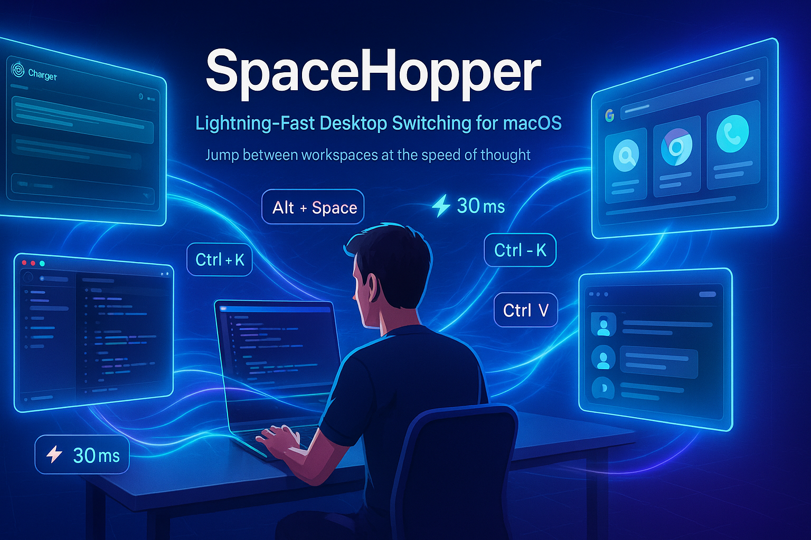

# SpaceHopper (lite)



[English](#english) | [中文](#中文)

---

## English

**SpaceHopper (lite)** is a minimal macOS virtual-desktop switcher with **state-tracking toggle**, built **without yabai** and **without disabling SIP**.

- Jump to a specific desktop with one hotkey (e.g. `Ctrl+K` → Desktop 1).
- Press the same hotkey again to **toggle back** to the previous desktop.
- Works with trackpad swipes / manual switches — the current desktop is queried live, so the toggle never gets out of sync.

### Why "lite"?

The original SpaceHopper relied on [yabai](https://github.com/koekeishiya/yabai)'s `space --focus`, which **requires partially disabling SIP** (recovery-mode `csrutil`, scripting addition injected into Dock). On locked-down machines that isn't an option.

This lite version replaces yabai with two tiny first-party mechanisms — **no SIP changes, no Dock injection**:

| Concern | yabai version | lite version |
|---|---|---|
| Query current desktop | `yabai -m query --spaces` | `current-space` — SkyLight **read-only** (`SLSGetActiveSpace`) |
| Switch desktop | `yabai -m space --focus N` | `switch-space` — `CGEvent` simulates the native **"Switch to Desktop N"** shortcut |

Both only need the standard **Accessibility** permission.

### Requirements

- macOS (tested on macOS 26 / Apple Silicon)
- [skhd](https://github.com/koekeishiya/skhd) — hotkey daemon (`brew install koekeishiya/formulae/skhd`)
- Xcode Command Line Tools (`swiftc`, for building the two helpers)
- **No yabai. No SIP changes.**

### Install

```bash
git clone <your-fork> ~/Documents/GithubRepo/SpaceHopper
cd ~/Documents/GithubRepo/SpaceHopper

# 1) Build the Swift helpers
./build.sh

# 2) Install the skhd config
mkdir -p ~/.config/skhd
cp configs/skhd/skhdrc ~/.config/skhd/skhdrc   # edit the path inside if your clone is elsewhere

# 3) Start skhd
skhd --start-service
```

Then do these **one-time** steps (no SIP, just toggles):

1. **System Settings → Keyboard → Keyboard Shortcuts → Mission Control**: enable **"Switch to Desktop 1/2/3/4"** (default `Ctrl+1..4`). These are off by default.
2. **System Settings → Privacy & Security → Accessibility**: add and enable `/opt/homebrew/bin/skhd`.

### Default keybindings (4-desktop layout)

| Hotkey | Desktop | Example app |
|---|---|---|
| `Ctrl+K` | 1 | Chat (Feishu) |
| `Ctrl+E` | 2 | Browser (Chrome) |
| `Ctrl+V` | 3 | Editor (Cursor) |
| `Ctrl+X` | 4 | Music |
| `Alt+Space` | ↔ 3 | quick toggle to editor |

Each key toggles: press once to jump, press again to go back.

### Customize

- **Change a target desktop**: edit the number in the matching `bin/app_shortcuts/switch_to_*.sh` (`switch_to_target_desktop N`).
- **Add a hotkey**: copy one of the scripts, set its target desktop, then add a line in `~/.config/skhd/skhdrc` and `skhd --restart-service`.
- **Switch animation feels slow?** That's the native macOS slide. Enabling *Reduce Motion* turns it into a fast fade. Instant (no-animation) switching is only possible with yabai (SIP off), which this version intentionally avoids.

### Notes / limitations

- Only desktops **1–9** are reachable (native `Ctrl+number` shortcuts).
- The toggle state is stored in `/tmp/last_space`.
- VSCode position tracking from the original (yabai-based) is not available without yabai.

---

## 中文

**SpaceHopper（lite）** 是一个极简的 macOS 虚拟桌面切换器，带**状态跟踪 toggle**，**不依赖 yabai**、**不需要关闭 SIP**。

- 一个快捷键直达指定桌面（如 `Ctrl+K` → 桌面 1）。
- 再按一次同一个键，**toggle 回到上一个桌面**。
- 兼容三指滑动 / 手动切换——当前桌面是实时查询的，toggle 永远不会和真实位置脱节。

### 为什么是 "lite"？

原版 SpaceHopper 用 [yabai](https://github.com/koekeishiya/yabai) 的 `space --focus` 切空间，而它**必须部分关闭 SIP**（进恢复模式跑 `csrutil`、往 Dock 注入 scripting addition）。受限的机器（如公司电脑）做不到。

lite 版用两个极小的系统原生机制替代 yabai，**不动 SIP、不注入 Dock**：

| 需求 | yabai 版 | lite 版 |
|---|---|---|
| 查当前桌面 | `yabai -m query --spaces` | `current-space` —— SkyLight **只读**（`SLSGetActiveSpace`） |
| 切桌面 | `yabai -m space --focus N` | `switch-space` —— `CGEvent` 模拟系统自带的**「切换到桌面 N」** |

两者只需要标准的**「辅助功能」**权限。

### 前置要求

- macOS（在 macOS 26 / Apple Silicon 上验证）
- [skhd](https://github.com/koekeishiya/skhd) 热键守护进程（`brew install koekeishiya/formulae/skhd`）
- Xcode Command Line Tools（`swiftc`，用于编译两个 helper）
- **不需要 yabai，不需要改 SIP。**

### 安装

```bash
git clone <你的 fork> ~/Documents/GithubRepo/SpaceHopper
cd ~/Documents/GithubRepo/SpaceHopper

# 1) 编译两个 Swift helper
./build.sh

# 2) 安装 skhd 配置
mkdir -p ~/.config/skhd
cp configs/skhd/skhdrc ~/.config/skhd/skhdrc   # 仓库不在默认路径就改一下里面的路径

# 3) 启动 skhd
skhd --start-service
```

然后做两个**一次性**设置（都不关 SIP，点开关即可）：

1. **系统设置 → 键盘 → 键盘快捷键 → 调度中心**：勾选**「切换到桌面 1/2/3/4」**（默认 `Ctrl+1~4`）。这些默认是**关**的。
2. **系统设置 → 隐私与安全性 → 辅助功能**：添加并启用 `/opt/homebrew/bin/skhd`。

### 默认快捷键（4 桌面布局）

| 快捷键 | 桌面 | 示例应用 |
|---|---|---|
| `Ctrl+K` | 1 | 聊天（飞书） |
| `Ctrl+E` | 2 | 浏览器（Chrome） |
| `Ctrl+V` | 3 | 编辑器（Cursor） |
| `Ctrl+X` | 4 | 音乐 |
| `Alt+Space` | ↔ 3 | 快速 toggle 到编辑器 |

每个键都带 toggle：按一次跳过去，再按一次回来。

### 自定义

- **改目标桌面**：编辑对应的 `bin/app_shortcuts/switch_to_*.sh` 里的数字（`switch_to_target_desktop N`）。
- **加快捷键**：复制一个脚本，改目标桌面号，在 `~/.config/skhd/skhdrc` 加一行，然后 `skhd --restart-service`。
- **觉得切换动画慢？** 那是 macOS 原生横滑动画。打开「减弱动态效果」会变成快速淡出。真正的「零动画瞬移」只有 yabai（关 SIP）能做到，本版本刻意不走这条路。

### 说明 / 限制

- 只能到达桌面 **1–9**（受限于系统原生 `Ctrl+数字` 快捷键）。
- toggle 的状态存在 `/tmp/last_space`。
- 原版基于 yabai 的 VSCode 位置跟踪在无 yabai 下不可用。

### License

MIT
